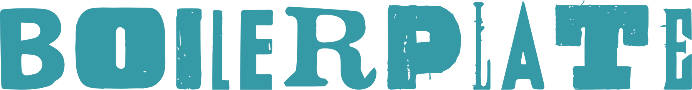

Grant writing made easy.

Boilerplate is an online tool for managing grant writing within an organization.
With Boilerplate, you can build custom, searchable libraries of content that can
be imported into grant templates where they can be revised into draft
applications.

## Contributing

For instructions on contributing, check out
[CONTRIBUTING.md](./docs/CONTRIBUTING.md).

1. follow up on giving frontend ability to know if current user is an admin and
   hiding users link from sidebar if not an admin
