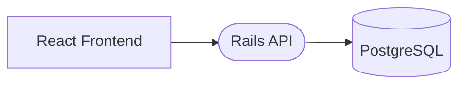

# Contributing

Thank you for taking interest in contributing to Boilerplate! This document
includes details on the application architecture, general project/code
guidelines, and instructions on how to setup your local development environment.

## Architecture

The overall architecture includes a React app that makes calls to a Rails API,
persisting data in a PostgreSQL database.



See [DEPLOYMENT.md](./DEPLOYMENT.md) for details on how the application is
deployed to a production environment.

## Project Guidelines

TODO

### File Structure

TODO

## Development Environment

### Setup using Docker

If you have Docker (v20 and up recommended) installed, you can utilize the
following commands to start the application:
```sh
# Start frontend, api, and postgres
$ docker compose up
# Run initial database setup
$ docker compose exec api rails db:create db:migrate db:seed
```

### Setup manually

#### Prerequisites:
* Node v16
* Ruby v2.7.5
* Bundler v2.2.32
* Rails v6
* Postgres v14

#### Initial startup commands:
```sh
# Inside api directory
$ bundle install
$ bundle exec rails db:create db:migrate db:seed
$ bundle exec rails server
=> Booting Puma
boilerplate-api-1  | => Rails 6.0.3.7 application starting in development
boilerplate-api-1  | => Run `rails server --help` for more startup options
boilerplate-api-1  | Puma starting in single mode...
boilerplate-api-1  | * Version 4.3.12 (ruby 2.7.5-p203), codename: Mysterious Traveller
boilerplate-api-1  | * Min threads: 5, max threads: 5
boilerplate-api-1  | * Environment: development
boilerplate-api-1  | * Listening on tcp://0.0.0.0:3000

# Inside frontend directory
$ npm install
$ npm start
> boilerplate_rebuild_react_app@0.1.0 start
> vite

  vite v2.9.14 dev server running at:

  > Local:    http://localhost:3001/
  > Network:  http://172.20.0.4:3001/

  ready in 2189ms.
```

## Recommended tools

* VSCode
