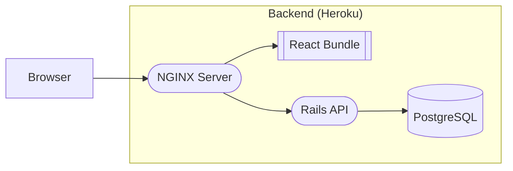

# Deployment

This contains instructions on deploying and maintaining Boilerplate on Heroku.

## Architecture



When deployed, the application consists of three servers:
1. A Rails server for API requests (through [Ruby
   buildpack](https://github.com/heroku/heroku-buildpack-ruby))
2. A PostgreSQL database server (through [Heroku Postgres
   Addon](https://www.heroku.com/postgres))
3. An NGINX static web server to serve the built react bundle and also act as a
   reverse proxy for API requests (through [NGINX
   buildpack](https://github.com/heroku/heroku-buildpack-nginx))

### Staging/Production Pipeline

There are two versions of the application: staging and production.
* When commits are pushed to the `develop` branch, they are immediately built
  and released to the staging environment
* After testing is complete, changes are promoted from staging into the
  production environment through [Heroku's pipeline
  feature](https://devcenter.heroku.com/articles/pipelines#deployment-with-pipelines)

#### Promoting to production

TODO

## Initial Setup

To deploy Boilerplate on Heroku, follow these steps:
1. Create an app for the API and Frontend on Heroku
2. Configure API
    1. Add the Heroku PostgreSQL addon
    2. Add the following environment vars to the app:
        ```sh
        FRONTEND_ORIGIN="frontend-app-name.herokuapp.com"
        SECRET_KEY_BASE="generate using bundle exec rake secret"
        DATABASE_URL="should be auto populated after installing Heroku PostgreSQL addon"
        ACTION_MAILER_GMAIL_ACCOUNT="your_email_address@gmail.com"
        ACTION_MAILER_GMAIL_PASSWORD="gmail app password"
        ```
    3. Inside the API directory, configure the remote and deploy:
        ```sh
        $ heroku git:remote -a <api-app-name>
        $ git push heroku develop:main
        ```
    4. *Optional:* To populate the app with test data, run the following command.
        ```sh
        # NOTE: This will clear out all records in the database!
        # NOTE: This command will output the credentials for the test account(s).
        $ heroku run -a <api-app-name> rails db:seed
        ```
3. Configure Frontend
    1. Add the following environment vars to the app:
        ```sh
        VITE_API_URL=https://api-app-name.herokuapp.com
        ```
    2. Add the following buildpacks:
        ```sh
        $ heroku buildpacks:add -a <frontend-app-name> heroku/nodejs
        $ heroku buildpacks:add -a <frontend-app-name> heroku-community/nginx
        ```
    3. Inside the Frontend directory, configure the remote and deploy:
        ```sh
        $ heroku git:remote -a <frontend-app-name>
        $ git push heroku develop:main
        ```

## Migrations

Migrations are automatically run before backend changes are released for both
staging and production so you don't need to worry about manually running them!
